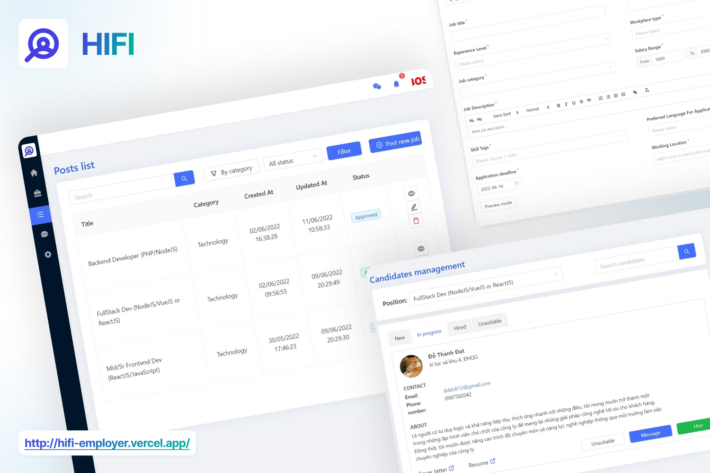

# HIFI

  
   
  HIFI = <b>Hire</b> & <b>Find</b>

**Hifi** is a web application for job seeking that is user-friendly, smart, and speedy. It will assist people in getting their desired job. People can readily find employment circulars in their field and apply. Applicants will receive notifications and will able to chat with recruiters. Recruiters, on the other hand, may quickly post a new job, handle applications, and interact with candidates. The overall interface is kept simple and appealing.

## Main features

- Create your profile
- Search your desired job
- Build your resume
- Apply for a job
- Calculate gross net salary
- Save for later
- See all companies
- View your notifications
- Interact with recruiters

## Tech stack

- Front end: NextJS, ReactJS, Ant Design, Socket.io, TailwindCSS
- State management: Redux, Redux Thunk, Redux Saga
- Back end: NodeJS, ExpressJS, Mongoose, Socket.io, Redis
- Database/Cloud: MongoDB, Cloudinary, Firebase

## Demo

- Visit one of below
  - Client: https://hifi.vercel.app/
  - Employer: https://hifi-employer.vercel.app/
- Sign up and log in
- Then, enjoy!

or

- Clone the [client repo](https://github.com/quangpn24/hifi-client), [employer repo](https://github.com/trunghq234/hifi-employer) and [server repo](https://github.com/ddatdt12/hifi-backend)
- Set up [MongoDB](https://www.mongodb.com/)
- Go to both project directories and run this command:
  `yarn start`
- And enjoy!

## Authors

- Trung Huỳnh- [trunghq234](https://github.com/trunghq234)
- Đỗ Văn Bảo - [baodv1001](https://github.com/baodv1001)
- Đỗ Thành Đạt - [ddatdt12](https://github.com/ddatdt12)
- Phan Ngọc Quang - [quangpn24](https://github.com/quangpn24)
- Trần Thế Anh - [anhtt2211](https://github.com/anhtt2211)

## Feedback

Create a feedback in [Issues](https://github.com/trunghq234/hifi/issues) section, each of your feedback will help us improve the app. Thank you once again for your assistance!
